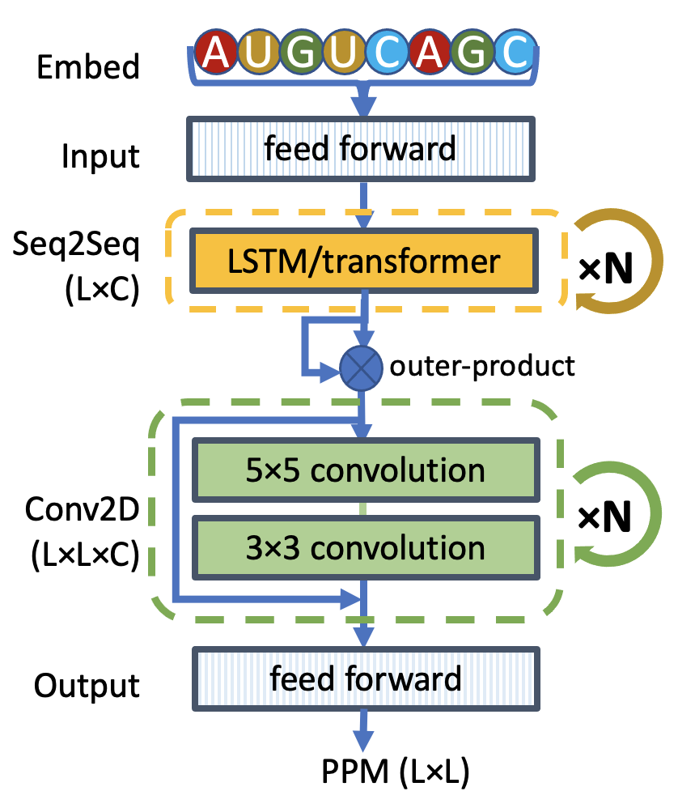

# SeqFold2D



A minimal two-module deep learning model for de novo prediction of RNA secondary structures.

## Main contents
1. src folder
   - contains all python codes for training, evaluation, and prediction
2. models folder
   - contains saved SeqFold2D models. Each model is named as {dataset}.{devset}.{nparams}. For each model, you can find 
      - args.json, the configuration file
      - minets_paddle.py, the source code at the time of model creation
      - net.state, the model state dictionary
      - opt.state, the optimizer state dictionary
3. examples folder
   - contains example fasta input files and training data
4. seqfold2d.sh - the main script

   
## Install
#### All in One
The simplest way is to create a new anaconda environment using the environment_[cpu|gpu].yml file by running:

`conda env create -f environment_[cpu|gpu].yml`

This will create conda environment seqfold2d_cpu or seqfold2d_gpu.

#### Conda GPU installation with CUDA 11.6
- Please refer to [installation guide](https://www.paddlepaddle.org.cn/documentation/docs/en/install/index_en.html) for other CUDA versions.
- If the program complains about libcudnn.so being not found or incompatible, you may need to add [path-to-seqfold2d-env]/lib to LD_LIBRARY_PATH
```
conda create -n seqfold2d_gpu python=3.10
conda install paddlepaddle-gpu==2.4.2 cudatoolkit=11.6 -c paddle -c conda-forge -y
conda install numpy pandas tqdm matplotlib scipy scikit-learn -y
conda install colorlog optuna -c conda-forge -y
```

#### Conda CPU installation
```
conda create -n seqfold2d_cpu python=3.10
conda install paddlepaddle==2.4.2 -c paddle -y
conda install numpy pandas tqdm matplotlib scipy scikit-learn -y
conda install colorlog optuna -c conda-forge -y
```

#### One by One by Hand
1. python=3.10
2. PaddlePaddle=2.4.2 (Please follow [the official installation instruction here.](https://www.paddlepaddle.org.cn/documentation/docs/en/install/index_en.html))
3. numpy>=1.21
4. pandas>=1.41
5. colorlog>=5.0.1
6. tqdm>=4.63
7. matplotlib>=3.5.1
8. scipy>=1.7.3
9. scikit-learn>=1.02
10. optuna>=3.0
    

## Usage
seqfold2d.sh should be the only script needed to run the code. It can be run without argument to get the following help:

```
Usage: seqfold2d.sh action data_files [cmdArgs]

Arguments:
    action          : one of train, predict, or brew_dbn/brew_ct/brew_bpseq
    data_files      : pkl file(s) for train, fasta file(s) for predict, folder for brew_dbn/ct/bpseq
    -model       [] : choose a model from the following (default: bprna.TR0VL0.960K):
                              bprna.TR0VL0.2p2M
                              bprna.TR0VL0.3p5M
                              bprna.TR0VL0.960K
                               stralign.ND.1p4M
                      stralign.ND.1p4M.alpha300
                               stralign.ND.960K
                             stralign.NR80.1p4M
                             stralign.TRVL.960K
                               strive.tRNA.400K

    -cmdArgs        : all other options are passed to fly_paddle.py as-is

    SPACE in folder/file names will very likely BREAK the code!!!

```

<!-- ### Error messages
Multiprocess PaddlePaddle appears to throw many error messages during the run, which is an open issue on github (https://github.com/PaddlePaddle/Paddle/issues/46870). It does NOT appear to affect the running of the program. -->

## Examples

### Brew data for training
You only need to pre-process data if you are going to train a SeqFold2D model with your own data. The best starting place is a folder of bpseq, ct, or dbn files. Run the following command to generate a pkl file (saved from a pd.DataFrame) from a folder of dbn files.

`seqfold2d.sh brew_dbn [folder-name]`

- Replace brew_dbn by brew_ct for ct format and by brew_bpseq for bpseq format.
- The extension of each data file must be bpseq, ct, or dbn. 
- If with different extensions, pass `-ct_suffix <suffix without .>` to seqfold2d.sh (yes, use -ct_suffix even for brew_dbn or brew_bpseq).

Three files will be saved:
- folder-name.pkl for training
- folder-name.csv for inspection of correct parsing
- folder-name.json for some statistics of the dataset

### Train
You can first test your installation with the provided Stralign NR80 dataset before trying one of the three ways below.

   `seqfold2d.sh train -model bprna.TR0VL0.960K examples/stralign_nr80.pkl -resume true`

1. Fine-tune or retrain from scratch one of the saved models

   `seqfold2d.sh train -model bprna.TR0VL0.960K train_data_file -resume true`

This will fine-tune the SeqFold2D-960K model trained with the bpRNA TR0 and VL0 datasets. Remove "-resume true" for training from scratch. 

2. Train a new model modified from one of the saved models

   `seqfold2d.sh train -model bprna.TR0VL0.960K train_data_file -resume false -lstm_num 3 -lstm_dim 128`

The example above will start from the SeqFold2D-960K model and change the number of LSTM blocks from 2 to 3 and the channel size from 64 to 128.


3. Train a completely customized model. 
   
   This is a bit tricky as there are a number of parameters defining the architecture and training recipe. One way is to start from the models/bprna.TR0VL0.960K/args.json file and edit as needed. Then run the following command:

   `python3 src/fly_paddle.py train -config args.json -save_dir ./ -data_dir ./ -data_name train_data_file`

One major inconvenience is that most parameters in args.json are unused/obsolete. You should only need to edit the set of parameters underneath "------- lstm tower/module args" and "------- conv2d tower/module args" as annotated below:

```
    "conv2d_norm_in": false,        # whether to normalize the input to the Conv2D module
    "conv2d_num": 4,                # the number of repeating Conv2D blocks (each block has two Conv2D layers)
    "conv2d_dim": [64, 64],         # the channel sizes of the two Conv2D layers in each block
    "conv2d_kernel": [5, 3],        # the kernel sizes of the two Conv2D layers in each block
    "conv2d_stride": [1],           # the stride 
    "conv2d_dilation": [1],         # the dilation factor
    "conv2d_padding": null,         # unused
    "conv2d_act_fn": null,          # activation function (null --> use default: LeakyRelu)
    "conv2d_norm_fn": null,         # normalization function (null --> use default: layer norm)
    "conv2d_norm_axis": null,       # unused
    "conv2d_norm_mask": null,       # unused
    "conv2d_norm_trainable": null,  # whether to train alpha and beta (null --> use default: true)
    "conv2d_act_after_norm": true,  # whether to do activation after normalization (false will do before)
    "conv2d_pre_act_norm": true,    # whether to apply activation and normalization before convolution
    "conv2d_dropout": 0.15,         # dropout rate (typically 30-50% of that of the feedforward layers)
    "conv2d_resnet": true,          # whether this is a resnet
    "conv2d_resnet_beta": 1,        # the beta factor for resnet
    "conv2d_norm_out": null,        # whether to normalize the output from the Conv2D module (null --> default: True)
```

### Predict
1. Predict secondary structures from fasta file(s)
: We will use the 100 sequences in the examples/stralign_nr80_100Seqs.fasta file with model stralign.NR80.1p4M, run

```
seqfold2d.sh predict examples/stralign_nr80_100Seqs.fasta -model stralign.NR80.1p4M
```
A folder will be created under current directory and a bpseq file and pairing probability matrix will be saved for each sequence.
