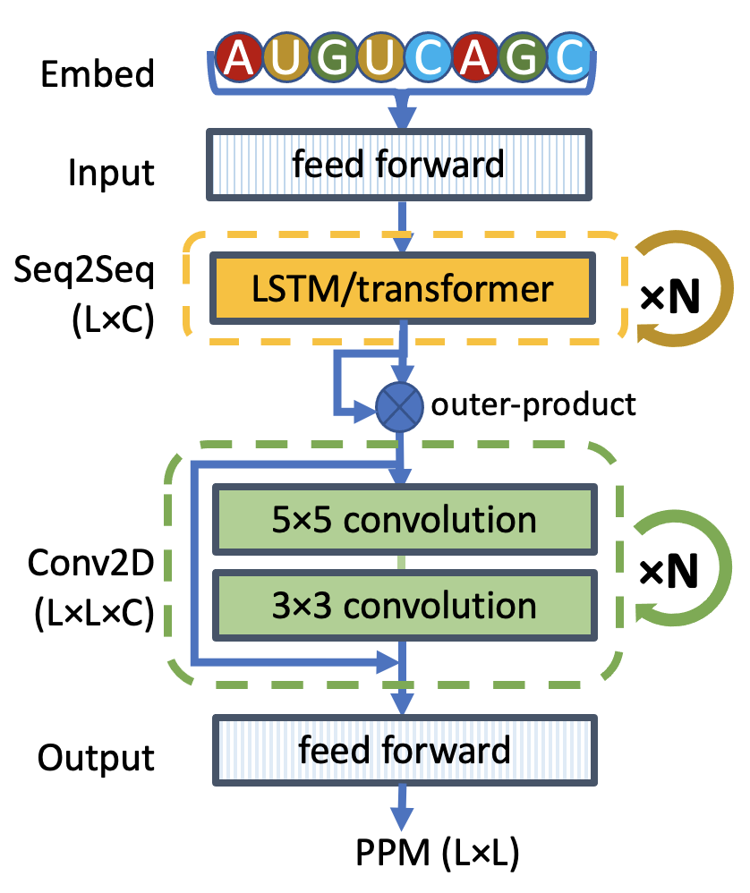

# SeqFold2D
A minimal two-module deep learning model for de novo prediction of RNA secondary structures


## Contents
1. src folder
   contains all python codes for training, evaluation, and prediction
2. models folder
   contains nine saved SeqFold2D models. Each model is named as {dataset}.{devset}.{nparams}. For each model, you can find 
    a) args.json, the configuration file
    b) minets_paddle.py, the source code at the time of model creation
    c) net.state, the model state dictionary
    d) opt.state, the optimizer state dictionary
3. figures folder
   contains various plots, though most are unannotated.
4. examples folder
   contains example fasta input files
5. seqfold2d.sh
   the main script. Run it with no argument to get help.

   
## Install

#### All in One
1. The simplest way is to create a new anaconda environment using the requirements_[cpu|gpu].txt or environment_[cpu|gpu].txt file by running:
> conda create -n [env-name] --file requirements_[cpu|gpu].txt
> conda env create -f environment_[cpu|gpu].yml
Warning: this will install a number of additional packages not directly used by SeqFold2D

#### One by One
1. python>=3.8
2. PaddlePaddle>=2.2.2 (Please follow [the official installation instruction here.](https://www.paddlepaddle.org.cn/documentation/docs/en/install/index_en.html))
3. numpy>=1.21
4. pandas>=1.41
5. colorlog>=5.0.1
6. tqdm>=4.63
7. matplotlib>=3.5.1
8. scipy>=1.7.3
9. scikit-learn>=1.02


## Usage
seqfold2d.sh should be the only script needed to run the code. It can be run without argument to get the following help:
```

Usage: seqfold2d.sh action data_files [cmOptions]

Arguments:
    action          : one of train, evaluate/eval, predict
    data_files      : one or multiple files of fmt: fasta or csv or pkl
    -model       [] : choose a model from the following (default: bprna.TR0VL0.960K):
                              bprna.TR0VL0.2p2M
                              bprna.TR0VL0.3p5M
                              bprna.TR0VL0.960K
                               stralign.ND.1p4M
                      stralign.ND.1p4M.alpha300
                               stralign.ND.960K
                             stralign.NR80.1p4M
                             stralign.TRVL.960K
                               strive.tRNA.400K

    -cmdArgs        : all other options are passed to fly_paddle.py as-is

    SPACE in folder/file names will very likely BREAK the code!!!

```

For example, to predict the secondary structures of the 100 sequences in the examples/stralign_nr80_100Seqs.fasta file with model stralign.NR80.1p4M, run
```
seqfold2d.sh predict examples/stralign_nr80_100Seqs.fasta -model stralign.NR80.1p4M
```
A folder will be created under current directory and a bpseq file and pairing probability matrix will be saved for each sequence.
